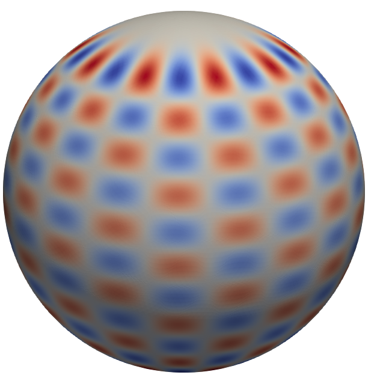
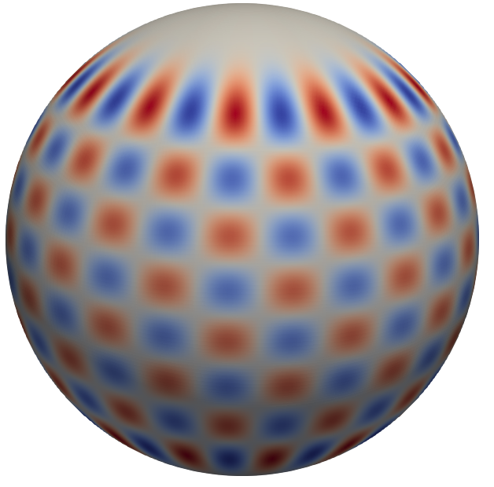
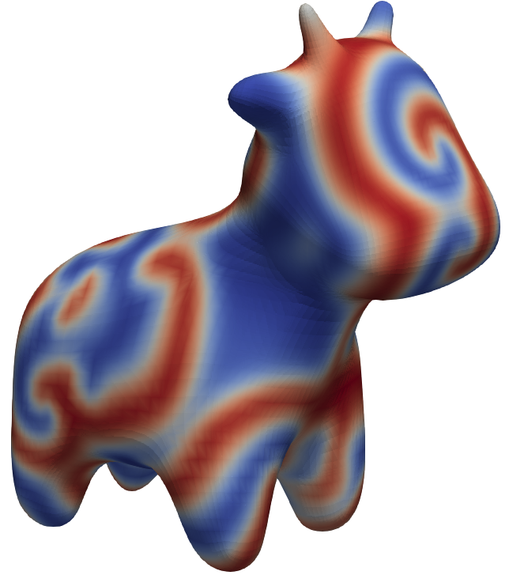
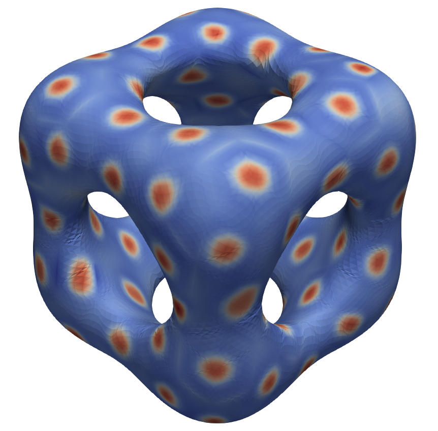

Notebook Examples
=================

The examples below are implemented as Jupyter notebooks in ``notebooks/``. Each
notebook writes visualization files to ``notebook_outputs/``. The images shown
here correspond to the VTU files listed with each example.

For repeatable runs, use ``pysurfacefun.Evaluator`` with JSONL, NPZ, and VTU
handlers. This writes deterministic snapshot filenames and a ``manifest.json``
describing the tasks and generated files.

The script ``examples/evaluator_outputs.py`` is a compact template for this
pattern.

Triangular Laplace-Beltrami on the sphere
-----------------------------------------

Notebook:
``notebooks/triangular_laplace_beltrami_sphere.ipynb``

Output:
:download:`tri_laplace_beltrami_sphere_refined_solution.vtu <_static/vtu/tri_laplace_beltrami_sphere_refined_solution.vtu>`

   High-order triangular Laplace-Beltrami solution on the sphere.

Surface biharmonic equation
---------------------------

Notebook:
``notebooks/surface_biharmonic_convergence.ipynb``

Output:
:download:`surface_biharmonic_sphere_solution.vtu <_static/vtu/surface_biharmonic_sphere_solution.vtu>`

   Surface biharmonic solution obtained by applying the second-order solver twice.

Cow surface reaction-diffusion
------------------------------

Notebook:
``notebooks/cow_reaction_diffusion.ipynb``

Output:
:download:`cow_complex_ginzburg_landau_real_u.vtu <_static/vtu/cow_complex_ginzburg_landau_real_u.vtu>`

   Real part of the complex Ginzburg-Landau field on an imported cow surface.

Swiss-cheese reaction-diffusion
-------------------------------

Notebook:
``notebooks/swiss_cheese_reaction_diffusion.ipynb``

Outputs:

* :download:`swiss_cheese_reaction_diffusion_u_0000.vtu <_static/vtu/swiss_cheese_reaction_diffusion_u_0000.vtu>`
* :download:`swiss_cheese_reaction_diffusion_u_1000.vtu <_static/vtu/swiss_cheese_reaction_diffusion_u_1000.vtu>`
* :download:`swiss_cheese_reaction_diffusion_u_2000.vtu <_static/vtu/swiss_cheese_reaction_diffusion_u_2000.vtu>`

   Reaction-diffusion state on the Swiss-cheese level-set surface.

Snapshot images matching the three exported VTU files:

.. list-table::
   :widths: 33 33 33
   :align: center

   * - ``k = 0``
     - ``k = 1000``
     - ``k = 2000``
   * - .. image:: _static/images/swiss_cheese_reaction_diffusion_u_0000.png
          :width: 100%
     - .. image:: _static/images/swiss_cheese_reaction_diffusion_u_1000.png
          :width: 100%
     - .. image:: _static/images/swiss_cheese_reaction_diffusion_u_2000.png
          :width: 100%
